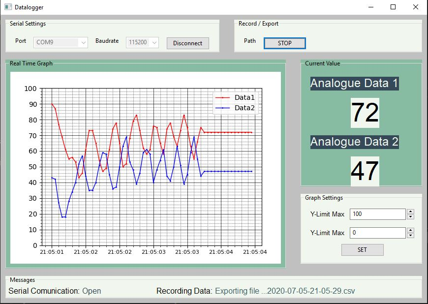
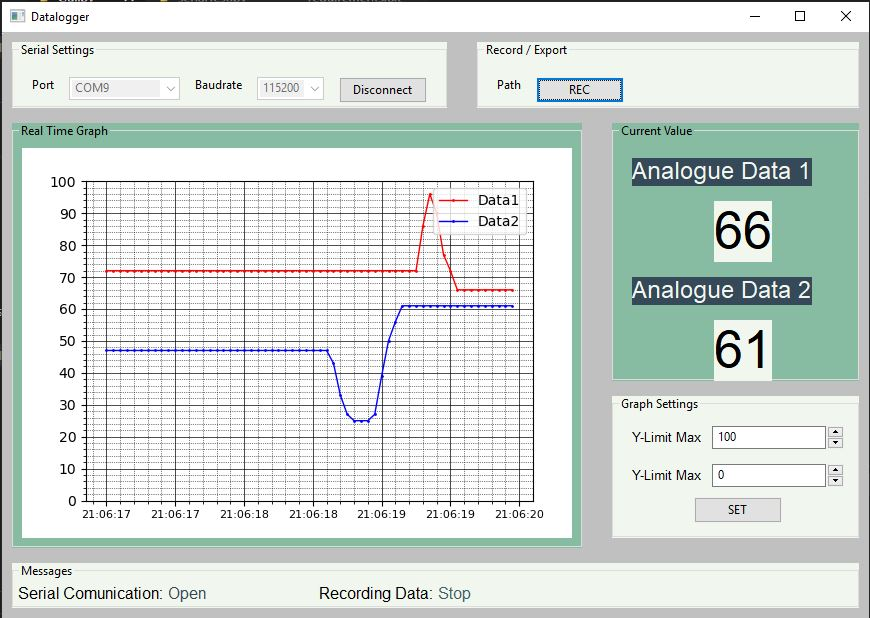

# GUI Python using WxPython
## Objetive
The objetive of this program is to design a GUI using serial protocol to get data from an arduino and graph them in real time. design a GUI using serial protocol

## Interface
The interface was developed in python v3.7 with the WxPython package, the final code is in the Gui.py file
The interface has a parameter serial box on the upper left side. In this one the user can configure the Port available and the Baud Rate (default value 115200).
On the right side there are three panels: 
- First has a rec button to save data entry and timestamp in a CSV file. 
- Second is a box that shows the current values entry.
- Third is a box with the options to change limits of the graph

On the left side there is a graph in real time for the data entry from serial protocol.

On the bottom side is a box with the status of serial protocol and recording status.

 
 

  

